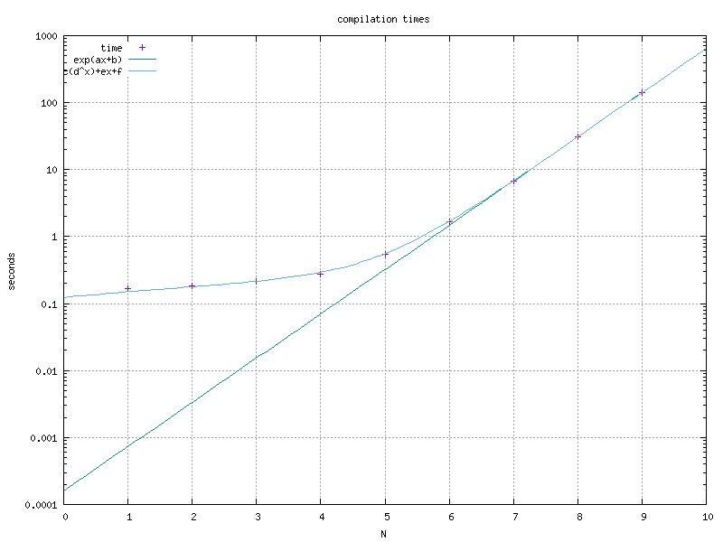

# Tower of Hanoi
_solved using C++ template metaprogramming_

## Problem

[Problem statement](https://en.wikipedia.org/wiki/Tower_of_Hanoi "Tower of Hanoi on wikipedia")

Goal: Move all discs from rod A to rod C.

## Solution

The algorithm uses a recursive approach:
```
ToH(N, A, B, C):
  if(N=0):
    return
  ToH(N-1, A, C, B)
  move(A,C)
  ToH(N-1, B, A, C)
```

Suppose `ToH(N, A, B, C)` solves the problem in N depth, by moving discs from A to C with the help of the B auxiliary rod. If we want to move a disc at N depth, the problem can be reduced to solving the problem of N-1 depth using the auxiliary rod as target first, moving the now topmost disc to the destination, and solving again for N-1 depth moving from the auxiliary rod to the destination.

By this recursive statement of the solution the base case will be N=1 where only the starting rod top disc will be moved to the destination rod. This is equivalent in the above stated pseudocode base case, as N=0 it will do nothing, making N=1 only the one desired step.

## Templates

In C++ template parameters can be types that have variable amount of numbers as parameters([variadic templates](https://en.cppreference.com/w/cpp/language/parameter_pack)). The Towers are defined by a name (only for validation and printing purpose) and variable amount of numbers as disc sizes. The solver expects a depth, and 3 storage types as template argumants. The solver will manipulate the types based on the recursive rules we established before. The solver will instantiate the end result state type, and the compiler instantiates the steps required by it. The Moves are concatenated along the way in a type.

At the end an incomplete type is instantiated with the solution moves which will print the error in the console and produce no executable. This way the proof that the computation occurs at compile time and no runtime overhead can exist is proven.

### Notation

The rods are encoded with a name and the list of discs they are containing, from top to bottom. `Tower_t<'A', 0, 1, 2>` denotes the rod named 'A' with discs of size 0, 1, 2 making the tower. Moves are encoded as a source and destination rod name, and the size of the disc it should move (the size of the topmost disc on the source rod before the move)

```
Tower_t<'A',0,1,2>, Tower_t<'B'>, Tower_t<'C'>:

    |         |         |    
   [0]        |         |    
  [ 1 ]       |         |    
 [  2  ]      |         |    
_____________________________
    A         B         C    
```
After the first move `Move_t<'A','C',0>`:
```
Tower_t<'A',1,2>, Tower_t<'B'>, Tower_t<'C',0>:

    |         |         |    
    |         |         |    
  [ 1 ]       |         |    
 [  2  ]      |        [0]   
_____________________________
    A         B         C    
```

The example was extended with an ASCII art step drawing utility, which computes the picture as a compile time type agregating the letters and creating a constexpr variable as the result containing the printable string.

## Building

The `make` command will do the work.

```bash
CXX=clang++ make height=7
```

The `height` optional parameter is used to change the initial height of the tower A. Default value is set in the makefile to 4.

The code works with C++17 standard, tested with clang++ version 15.0.7 and g++ version 12.2.1 as of writing this.

The compile time is not too bad, height=16 finishes around 8 seconds with both clang++ and g++ on my machine, which is not the latest CPU model.

```bash
make height=16 toh_moves_error
```

The drawing program is more heavy in template instantiation, and has 2 modes: drawing all the steps from start to finish with all the intermediate states included, or specifying the index of the desired step and drawing only that step with before and after state.

```bash
make height=8 move=137 toh_ascii
```

Compiling the ASCII art produces much more intermediate template classes and is generally prohibitively expensive on larger sizes. Producing all graphics for tower height 8 takes about 30 seconds, and the compilation times grow exponentially, which means a more beefy machine has only so much advantage before it is computationally infeasible.

### Example output

```
$ make
g++ -std=c++17 -Wall -Wextra -Wpedantic -Werror -O3 -DTOWER_HEIGHT=4  -ftemplate-depth=100000    toh_ascii.cpp   -o toh_ascii
g++ -std=c++17 -Wall -Wextra -Wpedantic -Werror -O3 -DTOWER_HEIGHT=4  -ftemplate-depth=100000    toh_moves_error.cpp   -o toh_moves_error
toh_moves_error.cpp:13:17: error: aggregate ‘Print<Moves_t<Move_t<'A', 'B', 0>, Move_t<'A', 'C', 1>, Move_t<'B', 'C', 0>, Move_t<'A', 'B', 2>, Move_t<'C', 'A', 0>, Move_t<'C', 'B', 1>, Move_t<'A', 'B', 0>, Move_t<'A', 'C', 3>, Move_t<'B', 'C', 0>, Move_t<'B', 'A', 1>, Move_t<'C', 'A', 0>, Move_t<'B', 'C', 2>, Move_t<'A', 'B', 0>, Move_t<'A', 'C', 1>, Move_t<'B', 'C', 0> > > as_error’ has incomplete type and cannot be defined
   13 | Print<solution> as_error;
      |                 ^~~~~~~~
make: *** [<builtin>: toh_moves_error] Error 1
$
```

### Exponential nature

The [compilation times](./times.txt) were measured and plotted on log-scale. The functions fitted were: `ax+b` on the log values of the data, and `c(d^x)+ex+f`. Both method yields around p=4.5 factor between tower height increments.



Number of moves generated this way is 2^N-1, which is already exponential, each move is (6N+3)\*N characters sized drawn out. This accounts for the output size scaling O(4^N). The additional p=4.? part may come from helper templates that needs calculating string parts recursively or scaling poorly due to the declarative nature of the template metaprogramming.

